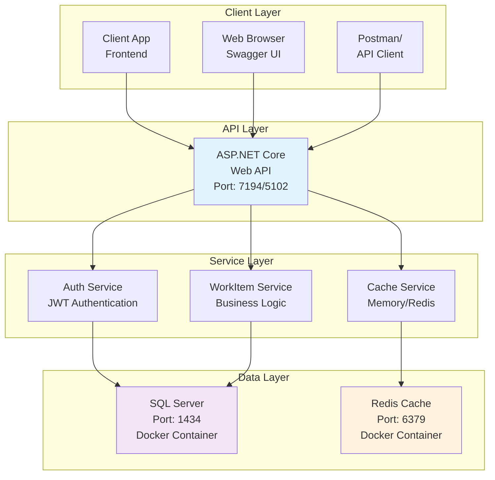
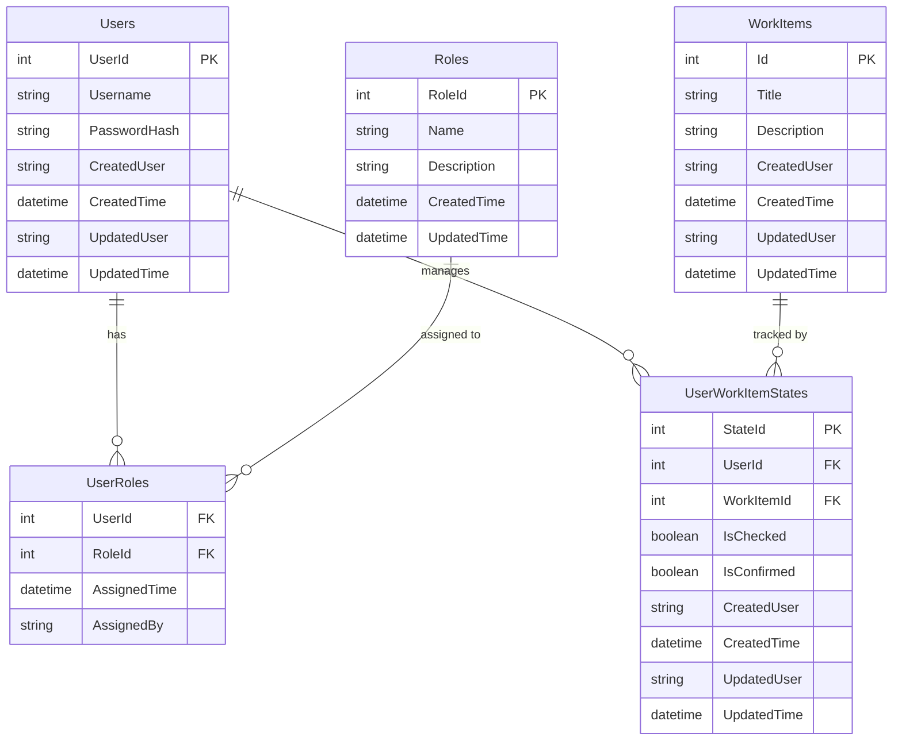
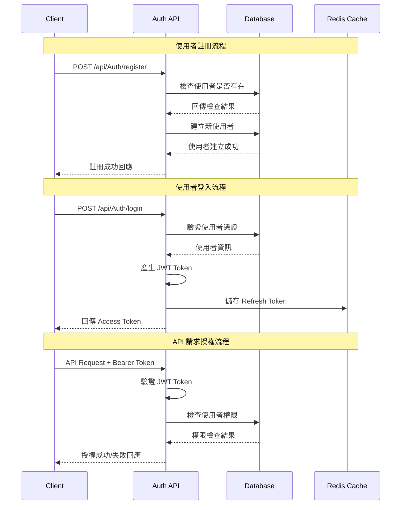
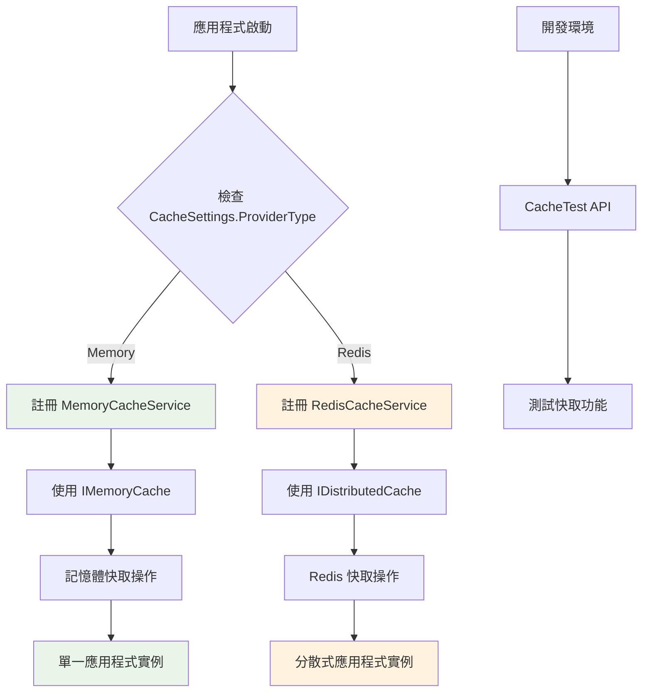
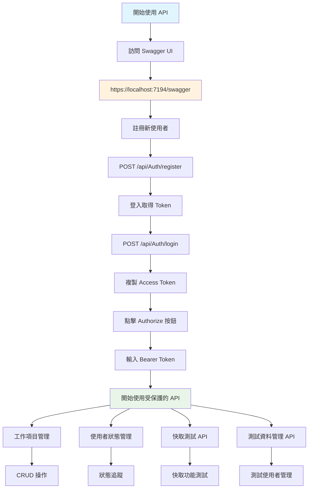
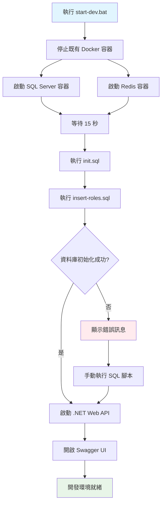

# WorkItemListApp - ASP.NET Core Web API

一個基於 ASP.NET Core 8 的工作項目管理系統，支援 JWT 認證、Redis 快取、Docker 容器化部署。

## 🚀 快速啟動

### 一鍵啟動開發環境
```bash
# 確保已安裝 .NET 8 SDK、Docker Desktop、SQL Server Command Line Tools
start-dev.bat
```

### 停止服務
```bash
stop-services.bat
```

啟動完成後，訪問 **https://localhost:7194/swagger** 開始使用 API。

---

## 🏗️ 技術架構

### 技術棧
- **後端框架**: ASP.NET Core 8
- **資料庫**: SQL Server 2022 (Docker)
- **快取**: Redis 7 / In-Memory Cache
- **認證**: JWT Bearer Token
- **容器化**: Docker & Docker Compose
- **API 文件**: Swagger/OpenAPI

### 系統架構圖



### 資料庫架構



## 📋 功能特色

### 🔐 認證與授權
- JWT Bearer Token 認證
- 角色基礎存取控制 (RBAC)
- 支援 Admin 和 User 角色
- Token 刷新機制
- 登出黑名單機制

#### 認證流程圖



### 💾 快取系統
- **動態快取提供者切換**
  - Memory Cache (預設)
  - Redis Cache (分散式)
- 支援快取過期時間設定
- 快取鍵存在性檢查
- 開發環境快取測試 API

#### 快取切換流程圖



### 🗄️ 資料管理
- 工作項目 CRUD 操作
- 使用者狀態管理 (IsChecked, IsConfirmed)
- 角色管理與使用者角色關聯
- 開發環境測試資料 API

### 🐳 容器化部署
- Docker Compose 一鍵啟動
- SQL Server 容器化
- Redis 容器化
- 自動化資料庫初始化

## 🛠️ 開發環境設定

### 環境需求
- **.NET 8 SDK**: [下載連結](https://dotnet.microsoft.com/download/dotnet/8.0)
- **Docker Desktop**: [下載連結](https://www.docker.com/products/docker-desktop/)
- **SQL Server Command Line Tools**: [下載連結](https://docs.microsoft.com/en-us/sql/tools/sqlcmd-utility)

### 專案結構
```
WorkItemListApp/
├── WebApplication1/WebApplication1/          # ASP.NET Core Web API
│   ├── Controllers/                         # API 控制器
│   │   ├── AuthController.cs               # 認證相關 API
│   │   ├── WorkItemsController.cs         # 工作項目 API
│   │   ├── CacheTestController.cs         # 快取測試 API (僅開發環境)
│   │   └── TestDataController.cs          # 測試資料 API (僅開發環境)
│   ├── Services/                           # 業務邏輯服務
│   │   ├── ICacheService.cs               # 快取服務介面
│   │   ├── MemoryCacheService.cs         # 記憶體快取實作
│   │   ├── RedisCacheService.cs          # Redis 快取實作
│   │   └── AuthService.cs                # 認證服務
│   ├── Models/                            # 資料模型
│   │   ├── User.cs                        # 使用者模型
│   │   ├── Role.cs                        # 角色模型 (包含 UserRole)
│   │   ├── WorkItem.cs                    # 工作項目模型
│   │   └── UserWorkItemState.cs           # 使用者工作項目狀態模型
│   ├── Data/                              # 資料存取層
│   └── appsettings.json                   # 應用程式設定
├── db-scripts/                            # 資料庫腳本
│   ├── init.sql                          # 資料庫結構建立
│   └── insert-roles.sql                  # 預設角色資料
├── docker-compose.yml                     # Docker Compose 設定
├── start-dev.bat                         # 一鍵啟動腳本
├── stop-services.bat                     # 停止服務腳本
└── README.md                             # 專案說明文件
```

## 🔧 設定說明

### 快取設定
在 `appsettings.json` 中修改快取提供者：

```json
{
  "CacheSettings": {
    "ProviderType": "Memory"  // 或 "Redis"
  },
  "RedisSettings": {
    "ConnectionString": "localhost:6379",
    "InstanceName": "WorkItemListApp"
  }
}
```

### 資料庫連線
```json
{
  "ConnectionStrings": {
    "DefaultConnection": "Server=localhost,1434;Database=WorkItemListApp;User Id=sa;Password=yourStrong(!)Password123;TrustServerCertificate=True;MultipleActiveResultSets=true"
  }
}
```

## 📚 API 使用指南

### API 使用流程



### 認證流程
1. **註冊使用者**: `POST /api/Auth/register`
2. **登入**: `POST /api/Auth/login`
3. **取得 Token**: 從回應中取得 `accessToken`
4. **授權請求**: 在 Header 中加入 `Authorization: Bearer <token>`

### 主要 API 端點

#### 認證相關
- `POST /api/Auth/register` - 使用者註冊
- `POST /api/Auth/login` - 使用者登入
- `POST /api/Auth/refresh-token` - 刷新 Token
- `POST /api/Auth/logout` - 登出

#### 工作項目管理
- `GET /api/WorkItems` - 取得工作項目列表
- `POST /api/WorkItems` - 建立工作項目
- `PUT /api/WorkItems/{id}` - 更新工作項目
- `DELETE /api/WorkItems/{id}` - 刪除工作項目

#### 使用者狀態
- `GET /api/user/states` - 取得使用者狀態
- `POST /api/user/states` - 建立使用者狀態
- `PUT /api/user/states/{workItemId}` - 更新使用者狀態

### 開發環境專用 API

#### 快取測試 (僅開發環境)
- `GET /api/CacheTest/info` - 查看快取提供者資訊
- `POST /api/CacheTest/set` - 設定快取值
- `GET /api/CacheTest/get/{key}` - 取得快取值
- `DELETE /api/CacheTest/remove/{key}` - 移除快取值
- `GET /api/CacheTest/exists/{key}` - 檢查快取鍵是否存在

#### 測試資料管理 (僅開發環境)
- `POST /api/TestData/create-test-users` - 建立測試使用者 (admin/123456, user/123456)
- `POST /api/TestData/login-test-admin` - Admin 登入測試
- `POST /api/TestData/login-test-user` - User 登入測試
- `GET /api/TestData/test-users-status` - 檢查測試使用者狀態
- `DELETE /api/TestData/delete-test-users` - 刪除測試使用者

## 🚀 部署說明

### 開發環境部署流程



### 開發環境
```bash
# 一鍵啟動
start-dev.bat

# 停止服務
stop-services.bat
```

### 生產環境
1. 修改 `appsettings.json` 中的資料庫連線字串
2. 設定 Redis 連線 (如使用 Redis 快取)
3. 確保資料庫已初始化
4. 使用 `dotnet run` 或 IIS 部署

## 🔍 故障排除

### 常見問題

1. **資料庫連線失敗**
   - 檢查 Docker 容器是否正常運行
   - 確認 SQL Server 已完全啟動 (等待 15 秒)
   - 檢查連線字串設定

2. **Redis 連線失敗**
   - 確認 Redis 容器正在運行
   - 檢查 Redis 連線字串設定

3. **API 無法訪問**
   - 確認應用程式正在監聽正確的端口
   - 檢查防火牆設定
   - 確認 HTTPS 憑證設定

4. **測試 API 回傳 404**
   - 確認應用程式運行在開發環境
   - 檢查 `ASPNETCORE_ENVIRONMENT` 設定

## 📊 服務狀態

| 服務 | 地址 | 狀態 |
|------|------|------|
| Web API | https://localhost:7194 | ✅ |
| Swagger UI | https://localhost:7194/swagger | ✅ |
| SQL Server | localhost:1434 | ✅ |
| Redis | localhost:6379 | ✅ |